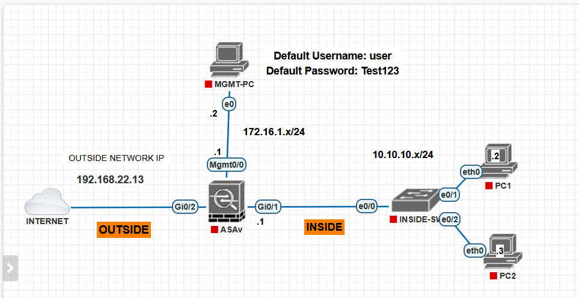

## 🔥 Cisco ASA Firepower Lab – README
## 📌 Overview

This project demonstrates the configuration of a Cisco ASA firewall with Firepower services to secure a small network. The lab includes inside, outside, and management networks, along with basic connectivity, NAT, and security policy enforcement.

## 🗺️ Network Topology
Outside Network (Internet)
IP: 192.168.22.13
ASA Firewall (ASAv)
Outside Interface: Gi0/2
Inside Interface: Gi0/1 → 10.10.10.1/24
Management Interface: Mgmt0/0 → 172.16.1.1/24
Inside Network
PC1: 10.10.10.2
PC2: 10.10.10.3
Management PC
IP: 172.16.1.2

## 🔐 Default Credentials
Username: user
Password: Test123
⚠️ Change these credentials in a real environment.

## 🎯 Objectives
Configure ASA interfaces (inside, outside, management)
Enable NAT for internet access
Set up basic access control policies
Integrate and manage Firepower services
Verify connectivity between inside hosts and the internet
Apply security inspection policies

## ⚙️ Configuration Steps
---
1. Interface Configuration
interface GigabitEthernet0/1
 nameif inside
 security-level 100
 ip address 10.10.10.1 255.255.255.0
---
interface GigabitEthernet0/2
 nameif outside
 security-level 0
 ip address 192.168.22.13 255.255.255.0
---
interface Management0/0
 nameif management
 security-level 100
 ip address 172.16.1.1 255.255.255.0
---
 
2. Default Route
route outside 0.0.0.0 0.0.0.0 192.168.22.1

3. NAT Configuration (PAT)
object network INSIDE-NET
 subnet 10.10.10.0 255.255.255.0
 nat (inside,outside) dynamic interface

4. Access Control Policy
access-list INSIDE-OUT extended permit ip any any
access-group INSIDE-OUT in interface inside

5. Enable Firepower Module
sw-module module sfr recover configure

Then access Firepower Management Center (FMC) or Firepower Device Manager (FDM) via:

https://172.16.1.1

## 🛡️ Firepower Configuration
Within Firepower:

Register the device (if using FMC)
Create:
Access Control Policy
Intrusion Policy
URL Filtering (optional)
Apply policy to the ASA device

## 🧪 Testing
Connectivity Tests

From PC1 / PC2:

ping 10.10.10.1        # ASA inside interface
ping 192.168.22.1     # Gateway
ping 8.8.8.8          # Internet
Verification Commands (ASA)
show interface ip brief
show route
show nat
show access-list
show conn
