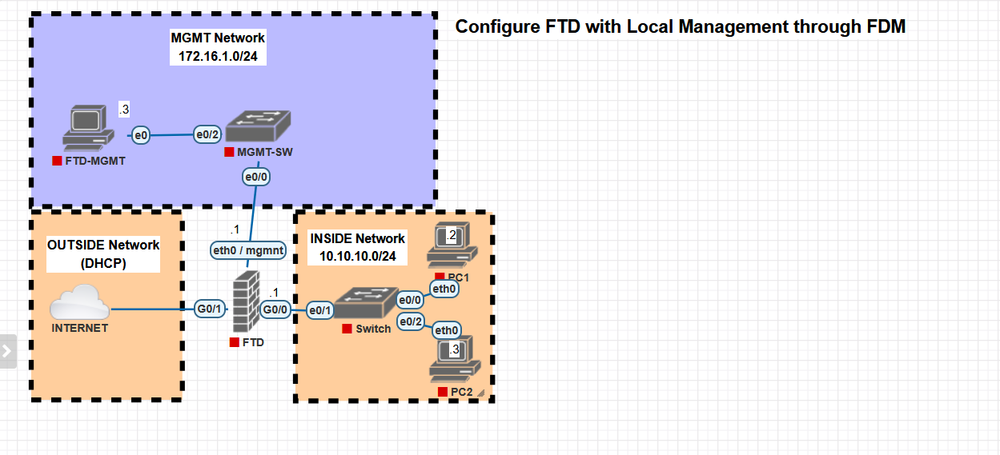

# 🔥 Cisco FTD with FDM (Local Management) Lab

## 📌 Overview

This project demonstrates how to configure a Cisco Firepower Threat Defense (FTD) firewall using **Firepower Device Manager (FDM)** for local management. The lab includes inside, outside (DHCP), and management networks with NAT, access control, and basic security policies.

---

## 🗺️ Network Topology

### 🌐 Outside Network (DHCP)

* Connected to Internet
* Interface: `G0/1`
* IP assigned dynamically via DHCP

### 🔥 FTD Firewall

* **Outside (G0/1):** DHCP (Internet)
* **Inside (G0/0):** `10.10.10.1/24`
* **Management (eth0 / mgmt):** `172.16.1.1/24`

### 🖥️ Inside Network (10.10.10.0/24)

* **PC1:** `10.10.10.2`
* **PC2:** `10.10.10.3`
* **Gateway:** `10.10.10.1`

### 💻 Management Network (172.16.1.0/24)

* **FTD-MGMT PC:** `172.16.1.3`
* **Gateway:** `172.16.1.1`

---

## 🔐 Default Credentials

Username: `admin`
Password: `Admin123`

> ⚠️ Change credentials after initial login.

---

## 🎯 Objectives

* Configure FTD interfaces (inside, outside, management)
* Enable DHCP on outside interface
* Configure NAT (PAT) for internet access
* Create Access Control Policy using FDM
* Verify connectivity from inside hosts to internet
* Manage FTD using FDM (GUI)

---

## ⚙️ Initial FTD Setup (CLI)

Connect to FTD console and configure basic settings:

```bash
configure network ipv4 manual 172.16.1.1 255.255.255.0 172.16.1.1
configure manager local
```

---

## 🌐 Access FDM (Web Interface)

From Management PC, open browser:

```
https://172.16.1.1
```

Login using default credentials.

---

## 🛠️ FDM Configuration Steps

### 1. Configure Interfaces

* Assign:

  * Inside → `10.10.10.1/24`
  * Outside → DHCP
* Enable interfaces

---

### 2. Configure NAT (Auto NAT / PAT)

* Inside → Outside dynamic PAT using interface IP

---

### 3. Access Control Policy

* Allow inside → outside traffic
* Apply default inspection policy

---

### 4. DNS & Routing

* Ensure default route via outside DHCP
* Configure DNS (e.g., `8.8.8.8`)

---

## 🧪 Testing

### From PC1 / PC2

```bash
ping 10.10.10.1
ping 8.8.8.8
```

---

### 🌍 Browser Test

* Open any website from PC1/PC2

---

## 🔍 Verification

From FDM:

* Dashboard → Traffic Monitoring
* Analysis → Connections
* Events → Security Events

---

## 📂 Project Structure

```
ftd-fdm-lab/
│── README.md
│── configs/
│   ├── ftd-base-config.txt
│   └── fdm-policy-notes.txt
│── topology.png
```

---

## ⚠️ Notes

* Ensure proper licensing for full Firepower features
* Use NTP for accurate logs
* Allow HTTPS access to management interface
* Disable unused services

---

## 🚀 Future Improvements

* Site-to-Site VPN
* Remote Access VPN (AnyConnect)
* URL Filtering & IPS tuning
* Integration with FMC
* VLAN segmentation
* Syslog / SIEM integration

---
