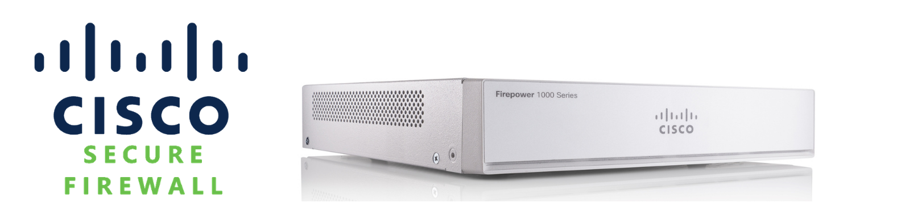

# Cisco Firepower Security Labs

## 📌 Overview
Hands-on firewall configuration using Cisco ASA and Firepower Threat Defense (FTD).

## 🔹 Projects Included
- ASA Basic Configuration
- FTD with FMC (centralized management)
- FTD with FDM (local management)

## 🔹 Skills Demonstrated
- Firewall configuration
- NAT implementation
- Access control policies
- Traffic filtering
